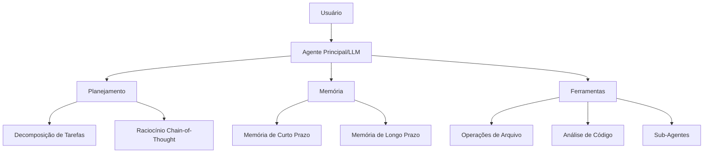
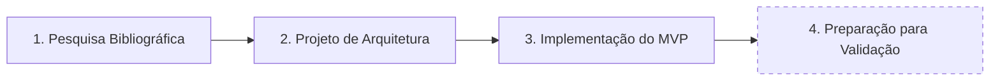
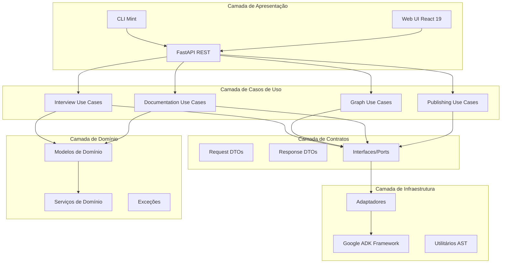
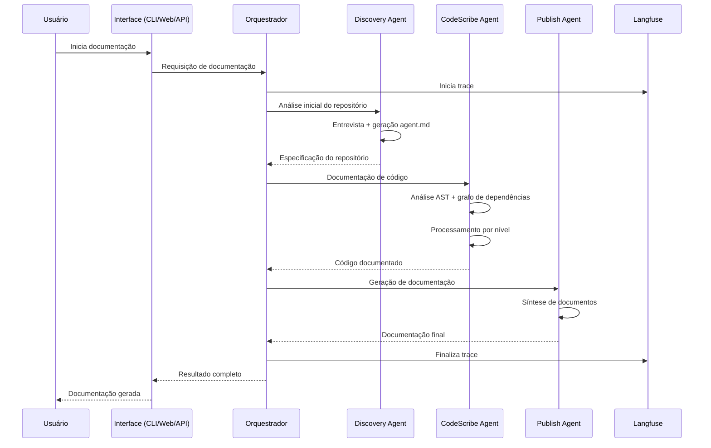
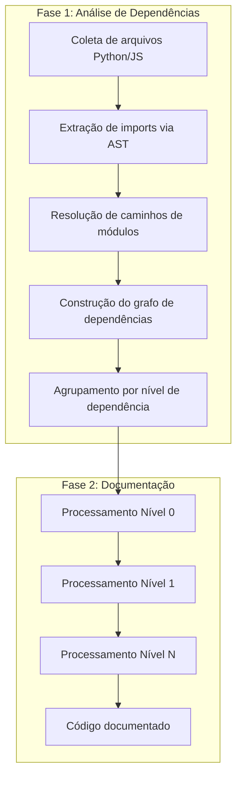
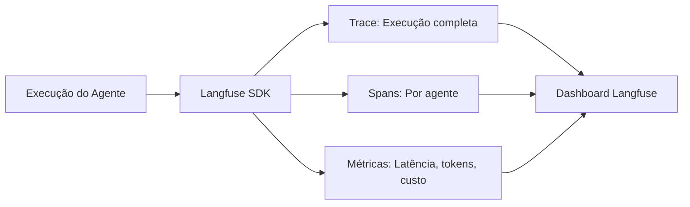
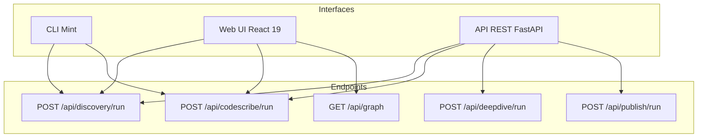

# Automação de Documentação de Código Legado Utilizando Agentes de Inteligência Artificial

**Autor:** Fábio Piemonte Lopes

---

## Resumo

A ausência de documentação estruturada em sistemas de software representa um dos principais obstáculos para a manutenção, evolução e automação inteligente de código legado. Este trabalho propõe o desenvolvimento de um sistema multiagente baseado em Large Language Models (LLMs) para geração automática de documentação técnica a partir da análise de repositórios de código-fonte. O sistema, denominado **doc_agent**, implementa uma arquitetura hierárquica de agentes especializados que combinam análise estática de código (AST), processamento em ordem de dependência e observabilidade integrada. A principal hipótese investigada é que aproximadamente 90% da eficácia de agentes de IA na geração de código deriva de contexto estruturado, e não das capacidades inerentes do modelo. O trabalho encontra-se na fase de pré-validação experimental, com o produto implementado e os testes planejados. A arquitetura proposta diferencia-se do estado da arte por seu processamento orientado a dependências, streaming de eventos em tempo real e múltiplas interfaces de usuário.

**Palavras-chave:** Documentação de código, Agentes de IA, Large Language Models, Sistemas multiagente, Código legado, Engenharia de contexto.

---

## 1. Introdução

### 1.1 Contextualização

Na era da Inteligência Artificial, a linguagem da programação está se transformando. Segundo pesquisadores da OpenAI, "a pessoa que melhor se comunica será o melhor programador do futuro" (OpenAI, 2024). Esta afirmação redefine o papel do desenvolvedor: não basta saber codificar — é preciso comunicar intenções com clareza para que sistemas inteligentes possam compreendê-las e agir sobre elas.

A integração de Large Language Models (LLMs) em fluxos de trabalho de desenvolvimento de software criou uma tensão fundamental entre a promessa da codificação assistida por IA e a realidade de saídas inconsistentes e pobres em contexto. Pesquisas recentes demonstram que abordagens sistemáticas para gerenciamento de contexto representam uma mudança de paradigma em direção a um desenvolvimento assistido por IA mais confiável e escalável.

### 1.2 Problema de Pesquisa

As organizações enfrentam um grande obstáculo: a ausência de documentação estruturada. Tanto as partes técnicas (código, APIs, integrações) quanto as partes de negócio (processos, objetivos, dependências) permanecem dispersas, implícitas e frequentemente obsoletas. Sem documentação, a IA não compreende o contexto — e, portanto, não consegue construir, manter ou evoluir sistemas com precisão.

Esta lacuna de contexto impede a automação inteligente de escalar efetivamente. A pergunta central que guia esta pesquisa é:

> **Como agentes autônomos baseados em modelos de linguagem podem gerar, atualizar e estruturar documentação técnica de forma automática e consistente, a partir de informações extraídas diretamente do código-fonte e da estrutura de dependências?**

### 1.3 Hipótese de Pesquisa

A análise de sistemas de codificação por IA existentes, incluindo Claude Code e Agent OS, revela um achado significativo: **aproximadamente 90% da capacidade operacional deriva de prompts adequadamente estruturados, enquanto apenas 10% advém das capacidades inerentes do modelo** (Casel, 2024). Esta descoberta fundamenta a abordagem adotada neste trabalho, que prioriza a engenharia de contexto sobre a otimização de modelos.

### 1.4 Objetivos

#### Objetivo Geral

Desenvolver e descrever um MVP funcional de um sistema multiagente autônomo de documentação de código, capaz de gerar e estruturar documentação técnica utilizando análise automatizada de repositórios e arquitetura modular.

#### Objetivos Específicos

1. Planejar a arquitetura de agentes especializados e suas ferramentas de operação
2. Definir um pipeline automatizado de análise, extração e geração de documentação
3. Implementar processamento orientado a dependências via análise AST
4. Integrar observabilidade contínua para monitoramento e avaliação
5. Preparar estratégia de validação experimental para avaliação do MVP

### 1.5 Estrutura do Documento

Este documento está organizado da seguinte forma: a Seção 2 apresenta a fundamentação teórica, abordando agentes de IA, engenharia de contexto e o estado da arte. A Seção 3 descreve a metodologia de pesquisa adotada. A Seção 4 detalha a proposta do sistema doc_agent, incluindo arquitetura e agentes especializados. A Seção 5 apresenta a estratégia de validação planejada. A Seção 6 discute as contribuições, limitações e trabalhos futuros. A Seção 7 conclui o trabalho.

---

## 2. Fundamentação Teórica

### 2.1 Documentação de Software e Sistemas Legados

A documentação de software é um componente crítico do ciclo de vida de desenvolvimento, servindo como ponte entre a implementação técnica e a compreensão humana do sistema. Em contextos de código legado, a documentação torna-se ainda mais crucial, pois frequentemente representa a única fonte de conhecimento sobre decisões arquiteturais, regras de negócio implícitas e comportamentos esperados do sistema.

Os principais desafios da documentação manual incluem:

- **Desatualização crônica**: A documentação tende a divergir do código ao longo do tempo
- **Incompletude**: Módulos críticos frequentemente carecem de explicações adequadas
- **Inconsistência**: Diferentes autores utilizam padrões e níveis de detalhe variados
- **Custo elevado**: Manter documentação atualizada consome recursos significativos

### 2.2 Agentes de IA e Large Language Models

#### 2.2.1 Arquitetura Fundamental de Agentes

Um agente de IA para desenvolvimento de software é composto por quatro pilares arquiteturais fundamentais:



**Modelo Central (LLM)**: Responsável pelo processamento de linguagem natural, tomada de decisões e coordenação do fluxo de trabalho.

**Sistema de Planejamento**: Decompõe tarefas complexas em subtarefas gerenciáveis, define sequências de execução e realiza ajustes dinâmicos baseados em feedback.

**Sistema de Memória**: Mantém o contexto da sessão atual (curto prazo), conhecimento persistente entre sessões (longo prazo) e registro de experiências anteriores (episódica).

**Ferramentas e Integrações**: Permitem interface com sistemas externos, execução de operações específicas e recuperação de informações.

#### 2.2.2 Da Engenharia de Prompts à Engenharia de Contexto

A evolução conceitual da engenharia de prompts para engenharia de contexto representa uma mudança fundamental na abordagem ao desenvolvimento assistido por IA. Schmid (2024) argumenta que "a nova habilidade em IA não é prompting, é engenharia de contexto", enfatizando que interações bem-sucedidas com IA requerem arquitetura de informação sistemática.

O framework teórico para engenharia de contexto abrange quatro componentes-chave:

1. **Montagem dinâmica de contexto**: Seleção inteligente de informações relevantes
2. **Integração de múltiplas fontes**: Combinação de código, documentação e metadados
3. **Gestão temporal de contexto**: Manutenção de coerência ao longo de sessões
4. **Integração de ferramentas**: Conexão com sistemas externos de análise

Ridnik et al. (2024), em seu trabalho seminal sobre AlphaCodium, introduziram o conceito de "flow engineering" — o design sistemático de processos multi-estágio e iterativos que substituem abordagens de prompt único por orquestração de fluxos de trabalho abrangentes. O AlphaCodium demonstrou melhorias de 44% em precisão em tarefas de programação competitiva.

### 2.3 Estado da Arte

#### 2.3.1 DocAgent (ACL 2025)

O DocAgent, apresentado na ACL 2025 por Yang et al., é um sistema multiagente colaborativo que utiliza processamento topológico de código para construção incremental de contexto. O sistema é composto por cinco agentes especializados:

| Agente | Função |
|--------|--------|
| Reader | Leitura e interpretação de código-fonte |
| Searcher | Busca de informações relacionadas |
| Writer | Geração de documentação |
| Verifier | Validação de precisão e consistência |
| Orchestrator | Coordenação do fluxo de trabalho |

A arquitetura do DocAgent utiliza análise AST para construção de um Directed Acyclic Graph (DAG) de dependências, processando arquivos em ordem topológica. Esta abordagem permite que a documentação de dependências esteja disponível quando arquivos dependentes são processados.

O framework de avaliação do DocAgent mede três dimensões: **Completeness** (completude), **Helpfulness** (utilidade) e **Truthfulness** (veracidade).

#### 2.3.2 CodeWiki (arXiv 2025)

O CodeWiki, desenvolvido por Nguyen et al., aborda a geração de documentação holística para grandes bases de código através de uma estratégia de decomposição hierárquica inspirada em princípios de programação dinâmica.

Características principais:

- **Suporte multilíngue**: Python, Java, JavaScript, TypeScript, C, C++, C#
- **Delegação dinâmica**: Agentes podem delegar módulos complexos para sub-agentes especializados
- **Processamento recursivo bottom-up**: Módulos folha são processados primeiro, com síntese hierárquica
- **CodeWikiBench**: Primeiro benchmark de documentação em nível de repositório

Resultados reportados:

| Categoria de Linguagem | CodeWiki | Baseline |
|------------------------|----------|----------|
| Alto nível (Python, JS, TS) | 79.14% | 68.67% |
| Gerenciadas (C#, Java) | 68.84% | 64.80% |
| Sistemas (C, C++) | 53.24% | 56.39% |

#### 2.3.3 Lacunas Identificadas

A análise do estado da arte revela oportunidades de contribuição:

1. **Processamento orientado a dependências com streaming**: Sistemas existentes processam em lote; há espaço para feedback em tempo real
2. **Observabilidade integrada**: Poucos sistemas oferecem instrumentação completa para análise de performance
3. **Múltiplas interfaces**: A maioria oferece apenas CLI ou API; interfaces visuais são limitadas
4. **Especificação de repositório**: A geração de documentação contextualizada ao projeto específico é pouco explorada

---

## 3. Metodologia

### 3.1 Caracterização da Pesquisa

| Aspecto | Descrição |
|---------|-----------|
| Tipo | Pesquisa aplicada, exploratória e experimental |
| Abordagem | Mista (qualitativa e quantitativa) |
| Método | Design Science Research |
| Coleta de dados | Análise de repositórios, métricas de sistema, feedback de usuários |

### 3.2 Fases do Desenvolvimento

O desenvolvimento do sistema seguiu quatro fases principais:



**Fase 1 - Pesquisa Bibliográfica**: Revisão sistemática da literatura sobre agentes de IA, engenharia de contexto, sistemas multiagente e documentação automatizada. Análise de mais de 45 fontes, incluindo trabalhos acadêmicos, implementações comerciais e desenvolvimentos da comunidade.

**Fase 2 - Projeto de Arquitetura**: Definição da arquitetura hierárquica de agentes, seleção de tecnologias (Google ADK, Python, React), especificação de interfaces e fluxos de dados.

**Fase 3 - Implementação do MVP**: Desenvolvimento do sistema completo, incluindo agentes especializados, ferramentas de análise AST, interfaces CLI e Web, e integração com observabilidade.

**Fase 4 - Preparação para Validação** (em andamento): Definição de métricas, instrumentos de coleta e protocolo experimental.

### 3.3 Instrumentos de Coleta Planejados

#### 3.3.1 Métricas Quantitativas (via Langfuse)

O sistema integra Langfuse para rastreamento completo de execuções:

| Métrica | Descrição |
|---------|-----------|
| `trace_id` | Identificador de execução ponta-a-ponta |
| `span_id` | Identificador de execuções internas por agente |
| Latência | Tempo de processamento por agente |
| Custo | Tokens consumidos por operação |
| Cobertura | Percentual de arquivos documentados |

#### 3.3.2 Métricas Qualitativas (via Formulário)

Um instrumento de coleta qualitativa foi desenvolvido com as seguintes seções:

| Seção | Foco |
|-------|------|
| Identificação | Papel do usuário, experiência, frequência de uso |
| Documentação de Uso | Clareza dos tutoriais e manuais gerados |
| Documentação de Código | Precisão técnica, estrutura, completude |
| Eficiência dos Agentes | Coerência, tempo, redundância |
| Experiência Geral | Satisfação e impacto percebido (NPS) |
| Sugestões | Melhorias e ideias de integração |

Escalas utilizadas: Likert (1-5) para percepção de qualidade; perguntas abertas para insights interpretativos.

### 3.4 Status Atual

O trabalho encontra-se na **fase de pré-validação experimental**:

- Pesquisa bibliográfica: **Concluída**
- Projeto de arquitetura: **Concluído**
- Implementação do MVP: **Concluída**
- Execução dos testes: **Planejada** (não executada)
- Análise de resultados: **Pendente**

---

## 4. Proposta: Sistema doc_agent

### 4.1 Visão Geral da Arquitetura

O **doc_agent** é um sistema multiagente autônomo baseado em LLMs, implementado sobre o **Google ADK** (Agent Development Kit), projetado para gerar documentação técnica de código-fonte automaticamente. O sistema transforma conhecimento implícito (em código e estrutura modular) em documentação estruturada e acessível.

#### 4.1.1 Princípios Arquiteturais

O sistema segue os princípios de **Clean Architecture** com inversão de dependência:



**Camada de Domínio**: Lógica de negócio pura, sem dependências de framework. Inclui entidades (Repository, Analysis, DependencyGraph, AgentSpecification) e serviços de domínio.

**Camada de Casos de Uso**: Regras de aplicação específicas. Orquestra operações de domínio e coordena interações com infraestrutura através de interfaces.

**Camada de Contratos**: Define DTOs e interfaces (ports) para comunicação entre camadas, garantindo inversão de dependência.

**Camada de Infraestrutura**: Implementações concretas de adaptadores, integração com Google ADK, utilitários de análise AST.

**Camada de Apresentação**: Interfaces de usuário (CLI interativa, Web UI, API REST).

#### 4.1.2 Fluxo Operacional Geral



### 4.2 Agentes Especializados

O sistema implementa quatro agentes principais, cada um com responsabilidades específicas:

#### 4.2.1 Discovery Agent

O Discovery Agent é responsável pela análise inicial e especificação do repositório.

**Responsabilidades**:
- Conduzir entrevista interativa com o usuário sobre o repositório
- Analisar estrutura de diretórios e arquivos
- Identificar tecnologias e padrões utilizados
- Gerar arquivo `agent.md` com especificação do repositório

**Modelo**: GPT-4o (configurável via LITELLM_MODEL)

**Ferramentas disponíveis**:
- `run_shell_command`: Execução de comandos de exploração
- `read_file_content`: Leitura de arquivos
- `investigate_with_detective`: Investigação profunda de código

**Saída gerada** (`.mint/agent.md`):
```markdown
# Agent Specification

## Repository Summary
[Descrição gerada a partir da entrevista]

## Architecture Overview
[Arquitetura identificada]

## Key Components
- Componente 1
- Componente 2

## Technology Stack
- Linguagens e frameworks

## Constraints & Limitations
- Limitações identificadas

## Documentation Requirements
- Requisitos específicos
```

#### 4.2.2 CodeScribe Agent

O CodeScribe Agent é o núcleo do sistema de documentação, responsável por adicionar docstrings ao código-fonte seguindo padrões estabelecidos.

**Pipeline de execução**:



**Estrutura do grafo de dependências** (`dependency_graph.json`):
```json
{
  "repo_path": "/caminho/do/repositorio",
  "clusters": [
    [{"path": "base.py", "level": 0, "internal_dependencies": []}],
    [{"path": "service.py", "level": 1, "internal_dependencies": ["base.py"]}]
  ],
  "max_level": 2,
  "total_files": 50,
  "cyclic_imports": [],
  "orphaned_files": []
}
```

**Estratégia de processamento**:
- **Nível 0**: Arquivos sem dependências internas (processados primeiro)
- **Nível N**: Arquivos que dependem apenas de níveis 0 a N-1
- **Benefício**: Dependências são documentadas antes de seus dependentes, permitindo contexto incremental

**Padrões de documentação**:
- Python: PEP 257 (docstrings)
- JavaScript: JSDoc

**Ferramentas**:
- `read_file_content`: Leitura do arquivo atual
- `read_dependency_file`: Leitura de documentação de dependências
- `write_file_with_docs`: Escrita do arquivo com docstrings adicionados

#### 4.2.3 DeepDive Agent

O DeepDive Agent realiza análise profunda de processos e fluxos complexos do sistema.

**Responsabilidades**:
- Análise de fluxos de execução
- Identificação de padrões arquiteturais
- Documentação de processos de negócio implícitos
- Geração de documentação de arquitetura

**Saídas geradas** (`docs/processes/`):
- Documentação de arquitetura
- Fluxos de dados
- Processos de negócio

#### 4.2.4 Publish Agent

O Publish Agent sintetiza toda a análise em documentação final formatada.

**Documentos gerados** (`docs/published/`):

| Documento | Conteúdo |
|-----------|----------|
| `getting_started.md` | Guia de início rápido |
| `tech_stack.md` | Stack tecnológico detalhado |
| `architecture.md` | Visão arquitetural |
| `business_logic.md` | Lógica de negócio documentada |

### 4.3 Diferenciais Técnicos

#### 4.3.1 Processamento Orientado a Dependências

Diferentemente de sistemas que processam arquivos em ordem arbitrária ou alfabética, o doc_agent utiliza análise AST para construir um grafo de dependências e processar arquivos em ordem topológica.

**Algoritmo de agrupamento**:

1. Coletar todos os arquivos Python e JavaScript
2. Extrair imports de cada arquivo via AST
3. Resolver caminhos de módulos (imports relativos e absolutos)
4. Construir grafo de dependências
5. Agrupar por nível:
   - Nível 0: Sem dependências internas
   - Nível N: Depende apenas de níveis 0 a N-1
6. Detectar ciclos e arquivos órfãos

**Diretórios ignorados**: `.git`, `.venv`, `node_modules`, `__pycache__`, `.pytest_cache`

#### 4.3.2 Streaming de Eventos em Tempo Real

O sistema emite eventos durante o processamento, permitindo feedback imediato ao usuário:

```python
# Eventos emitidos durante documentação
{
    "type": "file_start",
    "file": "core/services/analysis.py",
    "level": 2
}
{
    "type": "file_complete",
    "file": "core/services/analysis.py",
    "tokens_used": 1523
}
```

Interfaces (CLI, Web UI) consomem estes eventos via Server-Sent Events (SSE) ou WebSocket.

#### 4.3.3 Observabilidade Integrada

Integração nativa com **Langfuse** para instrumentação completa:



**Dados coletados**:
- `trace_id`: Identificação de execução ponta-a-ponta
- `span_id`: Identificação de execuções internas
- Latência por agente
- Tokens consumidos
- Taxa de sucesso/falha
- Metadados (repositório, tamanho, linguagens)

#### 4.3.4 Múltiplas Interfaces de Usuário

**CLI Mint**: Interface interativa de terminal com feedback em tempo real

**Web UI**: Dashboard React 19 com:
- Visualização de grafo de dependências (React Flow)
- Navegador de arquivos
- Interface de chat para Discovery
- Monitoramento de progresso

**API REST**: FastAPI para integração programática



### 4.4 Stack Tecnológico

| Componente | Tecnologia |
|------------|------------|
| Framework de Agentes | Google ADK 1.18+ |
| Linguagem Backend | Python 3.11+ |
| API | FastAPI |
| Frontend | React 19, TypeScript, Vite |
| Estilização | Tailwind CSS v4 |
| Estado Frontend | Zustand |
| Visualização de Grafos | @xyflow/react |
| Componentes UI | Radix UI |
| Observabilidade | Langfuse 3.9+ |
| LLM Gateway | LiteLLM |
| Parsing AST | tree-sitter, ast (Python) |
| Gerenciador de Pacotes | uv (Python), npm (Node) |

---

## 5. Estratégia de Validação

### 5.1 Métricas Quantitativas

As seguintes métricas serão coletadas via instrumentação Langfuse:

| Métrica | Descrição | Método de Coleta |
|---------|-----------|------------------|
| Cobertura documental | % de arquivos documentados com sucesso | Contagem automática |
| Tempo de execução | Latência por agente e total | Langfuse spans |
| Custo em tokens | Tokens consumidos por operação | Langfuse metrics |
| Taxa de sucesso | % de execuções sem erros | Langfuse traces |
| Consistência | Variação entre execuções similares | Análise estatística |

### 5.2 Métricas Qualitativas

O formulário de pesquisa qualitativa avaliará:

| Dimensão | Indicadores |
|----------|-------------|
| Compreensão do Código | Clareza das docstrings, explicação de fluxos |
| Usabilidade | Facilidade de navegação e aprendizado |
| Precisão Técnica | Correção das informações geradas |
| Impacto Percebido | Economia de tempo, utilidade prática |
| Satisfação Geral | NPS (Net Promoter Score) |

### 5.3 Protocolo de Validação Planejado

1. **Seleção de repositórios**: 3-5 repositórios de código aberto em Python e JavaScript
2. **Execução do sistema**: Documentação completa de cada repositório
3. **Coleta de métricas**: Via Langfuse (automático)
4. **Avaliação humana**: Desenvolvedores avaliam qualidade via formulário
5. **Análise cruzada**: Correlação entre métricas quantitativas e qualitativas

### 5.4 Status da Validação

A validação experimental encontra-se **planejada, mas ainda não executada**. Os instrumentos de coleta estão implementados (Langfuse integrado, formulário desenvolvido), aguardando execução dos testes com repositórios reais.

---

## 6. Discussão

### 6.1 Contribuições do Trabalho

Este trabalho apresenta as seguintes contribuições:

1. **Arquitetura de agentes orientada a dependências**: Diferentemente do DocAgent e CodeWiki, que utilizam processamento topológico genérico, o doc_agent implementa agrupamento por níveis de dependência com streaming de eventos.

2. **Observabilidade nativa**: Integração completa com Langfuse desde o design, permitindo análise detalhada de performance e custos.

3. **Múltiplas interfaces**: CLI, Web UI e API REST atendem diferentes perfis de usuário e casos de uso.

4. **Clean Architecture**: Separação rigorosa de camadas facilita manutenção e extensibilidade.

5. **Especificação de repositório**: O arquivo `agent.md` gerado pelo Discovery Agent fornece contexto estruturado para todos os agentes subsequentes.

### 6.2 Comparação com Estado da Arte

| Aspecto | DocAgent | CodeWiki | doc_agent |
|---------|----------|----------|-----------|
| Processamento | Topológico (DAG) | Hierárquico recursivo | Por níveis de dependência |
| Linguagens | Múltiplas | 7 linguagens | Python, JavaScript |
| Streaming | Não | Não | Sim |
| Observabilidade | Limitada | Limitada | Langfuse integrado |
| Interfaces | API | API | CLI, Web, API |
| Especificação de repo | Não | Não | agent.md |
| Framework | Proprietário | Proprietário | Google ADK (aberto) |

### 6.3 Limitações Identificadas

1. **Suporte a linguagens**: Atualmente limitado a Python e JavaScript; C/C++ e outras linguagens requerem extensão do parser AST.

2. **Validação empírica**: Testes formais ainda não executados; resultados quantitativos pendentes.

3. **Escala**: Comportamento em repositórios muito grandes (>100k LOC) não foi testado extensivamente.

4. **Dependência de LLM**: Qualidade da documentação depende do modelo utilizado; custos podem ser significativos para repositórios grandes.

5. **Detecção de ciclos**: Arquivos com dependências cíclicas são identificados mas tratamento não é otimizado.

### 6.4 Trabalhos Futuros

1. **Execução da validação experimental**: Aplicar o protocolo definido em repositórios reais
2. **Expansão de linguagens**: Adicionar suporte a Java, Go, TypeScript nativo
3. **Integração com Neo4j**: Implementar grafo de conhecimento para consultas semânticas
4. **Atualização incremental**: Detectar mudanças via Git e atualizar apenas documentação afetada
5. **Benchmark comparativo**: Comparação formal com DocAgent e CodeWiki em mesmos repositórios

---

## 7. Conclusão

Este trabalho apresentou o **doc_agent**, um sistema multiagente para automação de documentação de código legado utilizando Large Language Models. A arquitetura proposta implementa processamento orientado a dependências, observabilidade integrada e múltiplas interfaces de usuário, diferenciando-se do estado da arte em aspectos relevantes para aplicação prática.

A hipótese central — de que aproximadamente 90% da eficácia de agentes de IA deriva de contexto estruturado — fundamentou as decisões de design, priorizando engenharia de contexto sobre otimização de modelos. O arquivo `agent.md`, gerado pelo Discovery Agent, exemplifica esta abordagem ao fornecer especificação estruturada do repositório para agentes subsequentes.

O sistema encontra-se implementado e funcional, aguardando execução de validação experimental para quantificar sua eficácia. Os instrumentos de coleta (Langfuse, formulário qualitativo) estão preparados para aplicação do protocolo de validação definido.

As contribuições deste trabalho incluem: (1) arquitetura de agentes com processamento por níveis de dependência; (2) integração nativa de observabilidade; (3) múltiplas interfaces de usuário; (4) especificação estruturada de repositório via agent.md.

Como trabalhos futuros, destacam-se a execução da validação experimental, expansão do suporte a linguagens adicionais, integração com grafo de conhecimento e implementação de atualização incremental baseada em mudanças de código.

---

## Referências

CASEL, B. **Agent OS: A free open-source system to train smart AI coding agents**. Builder Methods, 2024. Disponível em: https://buildermethods.com/agent-os.

LANGCHAIN. **Context Engineering for Agents**. LangChain Blog, 2024. Disponível em: https://blog.langchain.com/context-engineering-for-agents/.

NGUYEN, A. H.; LE-ANH, M.; LE, B.; BUI, N. D. Q. **CodeWiki: Evaluating AI's Ability to Generate Holistic Documentation for Large-Scale Codebases**. arXiv, 2025. Disponível em: https://arxiv.org/abs/2510.24428.

RIDNIK, T. et al. **Code Generation with AlphaCodium: From Prompt Engineering to Flow Engineering**. arXiv, 2024. Disponível em: https://arxiv.org/abs/2401.08500.

SCHMID, P. **The New Skill in AI is Not Prompting, It's Context Engineering**. 2024. Disponível em: https://www.philschmid.de/context-engineering.

YANG, D.; SIMOULIN, A.; QIAN, X.; LIU, X.; CAO, Y.; TENG, Z.; YANG, G. **DocAgent: A Multi-Agent System for Automated Code Documentation Generation**. In: Proceedings of the 63rd Annual Meeting of the Association for Computational Linguistics (ACL 2025), System Demonstrations. Vienna, Austria, 2025. p. 460-471. DOI: 10.18653/v1/2025.acl-demo.44.

ANTHROPIC. **Building Effective Agents**. Anthropic Research, 2024. Disponível em: https://www.anthropic.com/engineering/building-effective-agents.

LLAMAINDEX. **Context Engineering - What it is, and techniques to consider**. LlamaIndex Blog, 2024. Disponível em: https://www.llamaindex.ai/blog/context-engineering-what-it-is-and-techniques-to-consider.

---

*Documento gerado como parte do Trabalho de Conclusão de Curso sobre Automação de Documentação de Código Legado Utilizando Agentes de Inteligência Artificial.*
